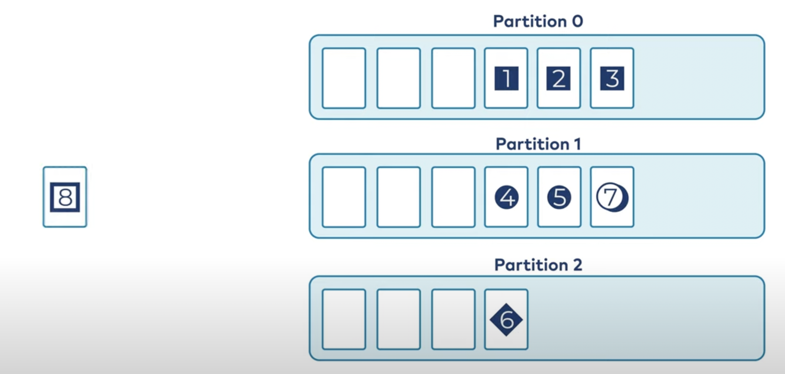
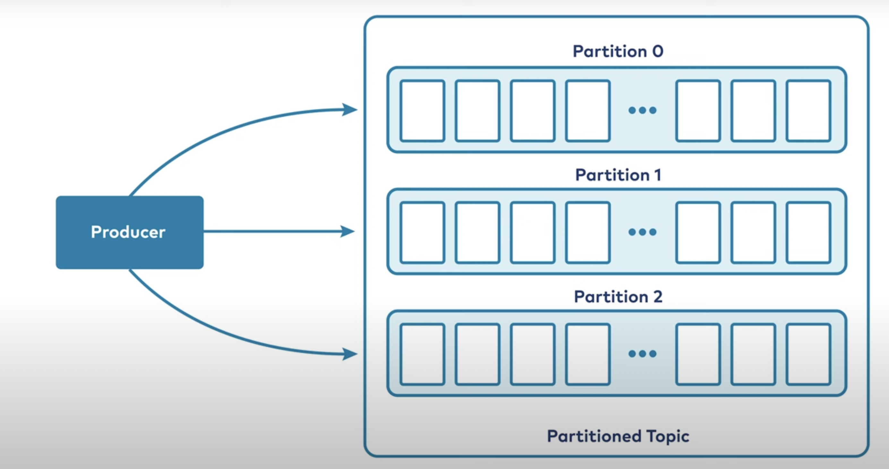

## What is Kafka?

Apache Kafka는 실시간 데이터 스트림을 대규모로 수집, 저장 및 처리하는데 사용되는 이벤트 스트리밍 플랫폼이다. 

이벤트란 무엇인가? Kafka가 이벤트를 저장하는 방법, 이벤트가 들어오고 나가는 방법, 이벤트를 분석하는 방법 등 먼저 이벤트가 무엇인지에 대한 합의가 이루어져야 할 것 같다. 

이벤트는 단지 'happen' 즉, '발생한 일' 이다. 이벤트의 종류는 다양할 수 있는데 예를 들어 프로세스의 변화라던지 사용자가 화면에 보이는 버튼위에 커서를 올려놓는 행위라던지, 마이크로서비스의 output이라던지 다양하게 존재 할 수 있다. 

이벤트를 비슷하지만 명확하게 정의하자면 **Notfication + State** 라고 할 수 있다. 즉, 이벤트는 다른 활동을 트리거 할 수 있으며 상태를 갖는다는 측면에서 그렇게 볼 수 있을 것 같다. 

Kafka에는 이벤트에 대한 데이터 모델이 존재한다. Kafka의 이벤트는 Key/Value 쌍으로 모델링된다. 여기서 말하는 Key는 DB에서 primary key와 같은 역할이라기 보다, 스마트 온도 조절기의 ID와 같은 특정 연결된 장치와 같은 시스템의 일부 엔티티의 식별자일 가능성이 더 크지만, 그렇다라고 듣고 넘어가는게 좋을 듯 하다. 

----

## Kafka - Topics 이란?

이벤트는 다양하고 방대하며 이를 조작할 시스템이 필요합니다. Kafka의 이벤트 구성단위는 'Topic'이라고 한다. Topic은 RDB에서 테이블과 같은 것이라고 생가할 수 있다. 

* Topics

개발 자라면 kafka를 프로그래밍하기 위해 '추상화'할 범위를 생각해야 한다. 때문에 kafka에서는 topic을 기준으로 추상화를 하고 이 topic이 일종의 클래스, 테이블의 역할을 하는 것이다. 

* Named container for similar events
    * System contain lots of topics
    * can duplicate data between topics

'Kafka에서 'Queue(대기열)'를 만든다' 는 문장은 수정이 필요하다. '대기열'이라고 말하는게 정확하지 않을 수 있기 때문이다.     

* Durable **logs** of events
    * Append only
    * can only seek by offset, not indexed

그리고 한번 발생한 이벤트는 돌릴 수 없다. Kafka에서 토픽의 이벤트는 변경할 수 없으며 로그의 매우 간단한 의미 체계로 인해 Kafka 높은 수준의 지속적인 처리량을 제공하는 것이 가능하다.  

* Events are immutable

----

## Kafka - Partitioning 이란?

kafka는 분산 처리 시스템이며 여러 대의 컴퓨터에서 작동하도록 설계되었고, 실제로 한 대의 컴퓨터인 것처럼 Kafka에 대한 코드를 작성할 수 있다. 

하나의 topic이 한대의 컴퓨터에 종속되게 하지 않도록 하기 위해서 하나의 topci은 여러 파티션으로 분리된다. 새 메시지 작성, 기존 메시지 읽기 등의 작업을 클러스터의 여러 노든 간에 분할 할 수 있다. 

topic을 여러 파티션으로 나눴음으로 어떤 메시지를 어떤 파티션에 쏠지 결정하는 방법이 필요하다. 이 topic에 대한 메시지를 작성하는 producer가 있고 topic은 여러 조각으로 파티셔닝 되기 때문에 주어진 메시지가 어느 파티션으로 가야하는지 알아야 한다. 

일반적으로 메시지에 키가 없을 경우 topic의 파티션간에 Round-Robin 으로 할당된다. 메시지에 키가 있다면 해당 키를 사용하여 메시지를 넣을 파티션을 파악한다. kafka는 동일한 키를 가진 메시지가 항상 동일한 파티션에 배치되어 항상 순서가 있음을 보장할 수 있다는 것이다. 

즉, 라운드 로빈으로 동작하는 경우 메시지는 여러 파티션에 동일하게 분배 되기 때문에 메시지의 전송 순서를 보장할 수 없습니다. 하지만 키를 가진 메시지라면 동일한 파티션에 할당 되기에 순서를 보장할 수 있습니다. 

----

## Kafka - Brokers 이란?

kafka에 대한 이벤트, topic, particioning 등, 이 작업을 수행하는 실제 컴퓨터는 무엇일까?

kafka는 브로커라는 네트워크로 구성된다. 

각 브로커는 클라우드의 인스턴스 일지도, 물리적 컴퓨터일 지도 모르지만 각각은 일부 kafka 파티션 집합을 호스팅하고 해당 파티션에 새 이벤트를 소거나 해당 파티션에서 이벤트를 읽기 위해 들어오는 요청을 처리한다. 

* Brokers
    * An Computer, instance, or container running the kafka process
    * Manage partitions
    * Handle write and read requests
    * Manage replication of partions
    * Intentionlly very simple

----

## Kafka - Replication 이란?

브로커와 기본 스토리지의 보안 취약성 때문에 파티션 데이터를 안전하게 유지하기 위해 다른 여러 브로커에 복사해야한다. 이러한 복제본을 팔로워 복제본이라고 한다.

* Replication 
    * Copies of data for fault tolerance
    * One lead partition(기본 파티션) and N-1 follwers 
    * In general, writes and reads happen to the leader
    * An invisible process to most developers
    * Tunable in the producer

----

## Kafka - Producer 이란?

kafka를 사용하는 생산자와 소비자에 대해 생각해보자. topic에 메시지를 넣고 topic에서 메시지를 읽는다. 

* Producers
    * client application
    * puts messages into topics
    * connection pooling
    * network buffering
    * partitioning

----

## Kafka - Consumers 이란?

